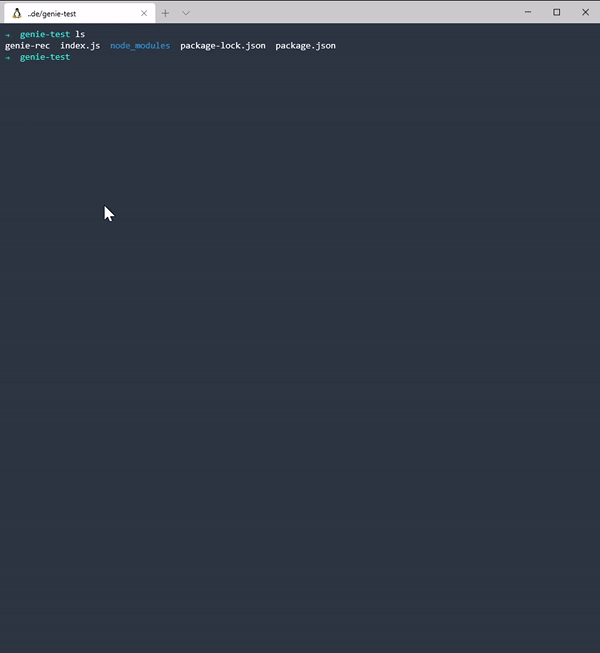

# genie.js

**genie.js** is a simple, highly-extensible, data-agnostic, and UI-agnostic genetic algorithm (GA) library for JavaScript. It's for developers who want to rapidly experiment with genetic algorithms without going through all the trouble of setting up all the boilerplate.

## Installation

Simply install from npm:

```bash
npm install --save @adrianperea/genie.js
```

## Nomenclature
**genie.js** breaks down the GA loop into three main components: the `Simulation`, the `Individual`, and the `Chromosome`.

### 1. Simulation
The `Simulation` is the workhorse of the entire library. It abstracts the entire GA loop so you can focus on getting results.

A `Simulation` only needs three components to get started: a copy of the `Individual` that will serve as the prototype of your entire population, a function to calculate the fitness of each individual, and a stopping condition. These are the information that are specific to your use case, and thus need to be defined.

### 2. Individual
An `Individual` represent a single member of the population. Each `Individual` contains one or more `Chromosome`s that describe its DNA. At its simplest, the `Individual` is only a container for the `Chromosome`, but more sophisticated use cases allows for more intricate `Individual`s.

### 3. Chromosome
A `Chromosome` represents the *genetic material* (In GA parlance: *genotype*) that constitutes each Individual. The `Chromosome` is what gives each `Individual` its identity, and is used when comparing one `Individual` to another.

## Example Usage

### Typical Workflow
The typical workflow when using **genie.js** is as follows:
1. Choose a `Chromosome` that represents your `Individual`. Alternatively, if none of the built-in `Chromosome`s fit your use case, you can easily create your own (see below).
2. Create an `Individual` as a prototype for your entire population by composing it with one or more `Chromosome`s.
3. Subclass the `Simulation` base class and define the `calculateFitness(individual)` and `shouldFinish(top)` functions. The former, as is evident, calculates the fitness for each individual, and the latter is a function that determines when the simulation should terminate, given the `top` individual (by default: individual with the highest fitness).
4. Create a config object that contains the GA information like population size, mutation rate, etc. This is also where you define the lifecycle hooks that let notify you of the state of the simulation at different points (e.g. when fitness is calculated).

### String Search
To illustrate the steps, here is a simple program that tries to find the binary string of length 16 `1010101010101010` using GA:

If you haven't already, install the library from npm:

```bash
npm install --save @adrianperea/genie.js
```

Next, we need to choose a `Chromosome` that represents our `Individual`. Our target is the string `1010101010101010`, so we can use the built-in `BinaryChromosome`:

```javascript
const genie = require('genie.js')

const { BinaryChromosome } = genie.chromosome;
```

Each `Chromosome` has a `fromLength(length)` factory method that creates a `Chromosome` with random data of length `length` from its charset. Since we're trying to guess a binary string of length 10, we should create a Chromosome using this length:

```javascript
const myFirstChromosome = BinaryChromosome.fromLength(10)
```

Afterwards, we then compose our `Individual` with it:

```javascript
const { Individual } = genie.individual;

const myFirstPrototype = new Individual()
myFirstPrototype.addChromosome(myFirstChromosome)
```

Using this, we can tell our `Simulation` what each `Individual` in the population should look like. Neat! In this, each `Individual` will be a combination of random `1`s and `0`s of length 10.

Next, we need to subclass the `Simulation` class, and define our `calculateFitness(individual)` and `shouldFinish(top)` methods:

```javascript
const { Simulation } = genie.simulation;

class BinaryStringSimulation extends Simulation {
  constructor(config) {
    super(config);
    // 1. We define a custom property to hold our target 1010101010
    this.target = config.target;
  }

  // 2. We calculate the fitness of each individual by how many digits did it get
  // in the correct position (see example below):
  // target: '1101', chromosome: '1101' # => fitness = 4
  // target: '1101', chromosome: '1100' # => fitness = 3
  calculateFitness(individual) {
    const fitness = individual.dna[0].genes.reduce(
      (fitness, gene, i) =>
        this.target[i] === gene ? (fitness += 1) : fitness,
      0
    );

    return fitness;
  }

  // 3. We tell our simulation when to stop. In this case,
  // if the fitness of our top individual is equal to the length of our target
  // (i.e. if each digit in each position is correct)
  shouldFinish(top) {
    return top.fitness === this.target.length;
  }
}
```

Finally, we can define our `Simulation` config and then run it:

```javascript
const config = {
  prototype: myFirstPrototype,
  target: '1010101010101010',
  onCalculateFitness(state) {
    // *
    console.log(state.top.fitness, state.top.getDna(0).join(''));
  }
};

const sim = new BinaryStringSimulation(config);
sim.start();
```
At the very least, you need to give your config your prototype. But that won't mean much without using any of the lifecycle hooks, since this is how the simulation updates you of the data changes. This is also what gives **genie.js** its flexibility: *since the state is decoupled from the UI, the user can choose whatever UI that's fit for the project.*

 As I've mentioned earlier, each lifecycle method gives us back the current state of the simulation. By default, it provides us the entire population, and top individual, the average fitness, and other pertinent statistics.

Pay attention to the section marked in asterisk. Each `Individual`, such as `top`, has access to its `fitness` and to its `dna`. An `Individual`s DNA is an array of chromosomes. Since we only defined one `Chromosome`, we can simply index it using `getDna(0)`. This will return as with an array of length 10, with each element being a `1` or a `0`. We can then use `join()` in order to make this into a bit string.

Here's the full source:

```javascript
const genie = require("genie.js");

const { BinaryChromosome } = genie.chromosomes;
const myFirstChromosome = BinaryChromosome.fromLength(16);

const { Individual } = genie.individual;
const myFirstPrototype = new Individual();
myFirstPrototype.addChromosome(myFirstChromosome);

const { Simulation } = genie.simulation;
class BinaryStringSimulation extends Simulation {
  constructor(config) {
    super(config);
    this.target = config.target;
  }

  calculateFitness(individual) {
    const fitness = individual.dna[0].genes.reduce(
      (fitness, gene, i) =>
        this.target[i] === gene ? (fitness += 1) : fitness,
      0
    );

    return fitness;
  }

  shouldFinish(top) {
    return top.fitness === this.target.length;
  }
}

const config = {
  prototype: myFirstPrototype,
  target: "1010101010101010",
  onCalculateFitness(state) {
    console.log(state.top.fitness, state.top.getDna(0).join(""));
  },
};

const sim = new BinaryStringSimulation(config);
sim.start();
```

Here's the program in action:



The left number represents the fitness, and the associated binary string. Great!

## Contributing
Pull requests are welcome. For major changes, please open an issue first to discuss what you would like to change.

Please make sure to update tests as appropriate.

## Author
**genie.js** was written by Adrian Perea. [Follow]() me on Twitter!
You can also reach out to me on adrianmarkperea@gmail.com

## TODO
- [ ] Add configuration information to README
- [ ] Add public API reference to README
- [ ] Add complex examples

## License
[MIT](https://choosealicense.com/licenses/mit/)
